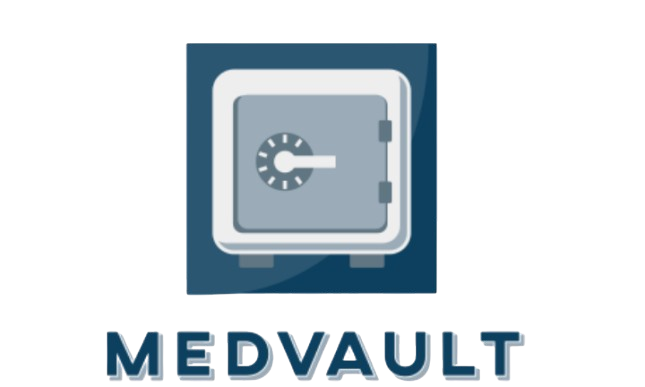

<div align="center">
  
  <h1>MedVault: QR-Based Health Dashboard</h1>
  <p>
    Your personal health record, accessible anywhere. A Streamlit web application for creating, managing, and sharing a secure digital health profile via a scannable QR code.
  </p>

  <a href="https://medvault.streamlit.app/" target="_blank">
    
  </a>


</div>

## 📖 About The Project

MedVault is a web application designed to solve the problem of managing and accessing personal health reports, especially in environments without advanced digital infrastructure. It allows patients to create a persistent digital profile, upload medical documents, and generate a unique QR code. This QR code can be scanned by any smartphone to display a secure, **view-only** version of their health dashboard, making it easy to share critical information with doctors quickly and efficiently.

### ✨ Core Features

* **Secure Patient Profiles:** Create a persistent health profile protected by a Patient ID and a PIN.
* **Editable Dashboard:** Log in to a full-featured dashboard to edit personal details, update medication lists, and manage your profile picture.
* **File Uploads:** Easily upload and store medical documents like blood tests, X-ray reports, and more.
* **Shareable QR Codes:** Generate a unique QR code that links to a password-less, read-only version of your dashboard, perfect for sharing with healthcare providers.
* **Interactive Medication Management:** Build and manage lists for "Currently Using Medicines" and "Medication History" with an easy-to-use interface.
* **Integrated Drug API:** Look up information on common medications directly within the app, powered by the openFDA API.

## 🛠️ Built With

* [Streamlit](https://streamlit.io/)
* [Pandas](https://pandas.pydata.org/)
* [QRCode](https://github.com/lincolnloop/python-qrcode)
* [Pillow](https://python-pillow.org/)
* [Requests](https://requests.readthedocs.io/en/latest/)

## 🚀 Getting Started

> **Live Demo:** You can try the live version of the app here: **[https://medvault.streamlit.app/](https://medvault.streamlit.app/)**

To get a local copy up and running, follow these steps.

### Prerequisites

* Python 3.9 or higher
* pip package manager

### Installation

1.  **Clone the repository:**
    ```sh
    git clone [https://github.com/NavaEmpire0/MedVault.git](https://github.com/NavaEmpire0/MedVault.git)
    cd MedVault
    ```
2.  **Create the required folder structure:**
    The application needs a `data` folder with an `uploads` subfolder to store patient files.
    ```sh
    mkdir -p data/uploads
    ```
3.  **Install the required packages:**
    ```sh
    pip install -r requirements.txt
    ```

### Running the App

1.  Navigate to the project directory in your terminal.
2.  Run the following command:
    ```sh
    streamlit run app.py
    ```
    Your web browser should automatically open to the application's login page.

## 📁 Project Structure
